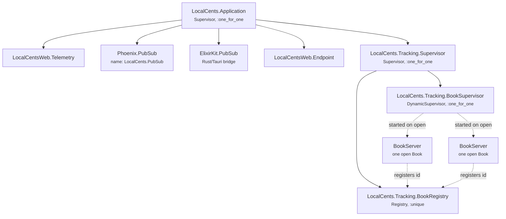
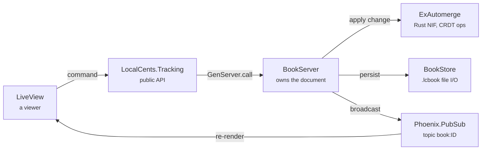
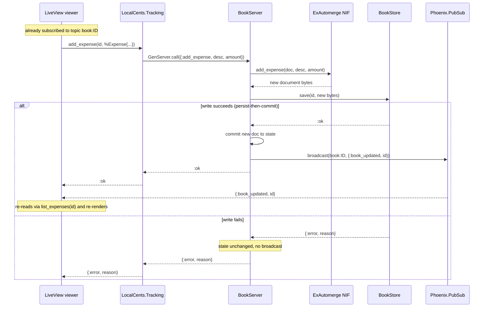
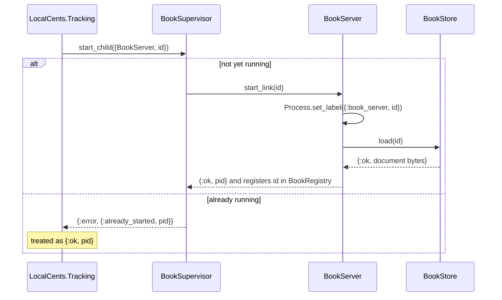
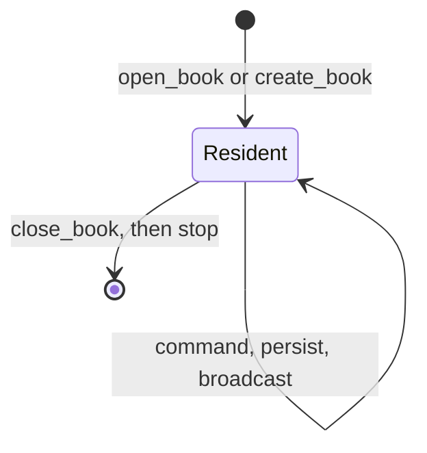

# Book Runtime Architecture

How an open **Book** lives at runtime: the processes that own its data, how they
are supervised, and how a change travels from a LiveView to disk and back out to
every viewer.

This is the *process* view. For the compile-time module/boundary view see
[Module Boundaries](module-boundaries.html); for the decision behind it see
[ADR 0007 — Book Runtime and Persistence](0007-book-runtime-and-persistence.html).

## The one-paragraph model

A Book is persisted as a single Automerge document in a `.lcbook` file. While a Book
is **open**, one `LocalCents.Tracking.BookServer` process holds that document in
memory and is the *single source of truth* for it. LiveViews never hold Book state;
they **subscribe** to the Book over `Phoenix.PubSub` and send **commands** to its
process. The process **persists each change first and, only once it is on disk,
commits it in memory and broadcasts** so every subscriber re-renders; a failed write
is returned to the caller rather than silently dropped. This is what lets several
viewers share one Book without divergence — the property the future web version
needs.

## Supervision tree

The tracking context owns its own runtime subtree, `LocalCents.Tracking.Supervisor`,
started once by `LocalCents.Application`. It supervises a **registry** (id → process
lookup) and a **dynamic supervisor** under which one `BookServer` is started per open
Book, on demand.



> The `BookServer` children are **transient at the tree level**: none exist until a
> Book is opened, and in the MVP each stays resident until explicitly closed. Only
> Books actually open on screen consume a process. (Solid edges are static children;
> dashed edges are created at runtime.)

### Who's who

| Process | Kind | Role |
|---|---|---|
| `LocalCents.Tracking.Supervisor` | `Supervisor` (named) | Roots the context's runtime; boots the registry and dynamic supervisor. |
| `LocalCents.Tracking.BookRegistry` | `Registry`, `:unique` (named) | Maps a Book **id → BookServer pid** so callers reach a Book's process by id. |
| `LocalCents.Tracking.BookSupervisor` | `DynamicSupervisor` (named) | Starts/stops one `BookServer` per open Book. |
| `LocalCents.Tracking.BookServer` | `GenServer` (one per open Book) | Owns the in-memory Automerge document; applies commands, persists, broadcasts. |

## Data flow of a change

Everything a viewer does routes through the `LocalCents.Tracking` public API, which
forwards to the Book's process. The process is the only thing that touches the
Automerge document (`ExAutomerge`) and the file (`BookStore`).



### Sequence: adding an expense



### Sequence: opening (or creating) a Book

`open_book/1` is idempotent — if the process is already running it is reused,
otherwise the dynamic supervisor starts one, which loads the document from disk.



## Finding processes in Erlang tooling

Two things make the runtime easy to browse in `:observer`, `:recon`, and crash logs:

- **Named infrastructure.** `Tracking.Supervisor`, `BookRegistry`, and
  `BookSupervisor` are registered under their module names, so they appear by name.
- **Labeled `BookServer`s.** A `BookServer` is registered through a `:via` tuple, so
  without help it would show only a bare pid. Its `init/1` calls
  `Process.set_label({:book_server, id})`, so tooling lists it by Book id instead.

```elixir
# In init/1 — makes the process identifiable by Book id.
Process.set_label({:book_server, id})
```

To confirm a label at runtime:

```elixir
[{pid, _}] = Registry.lookup(LocalCents.Tracking.BookRegistry, book_id)
:proc_lib.get_label(pid)
#=> {:book_server, "826f8d53-5036-459e-b4b1-c25695803164"}
```

In `:observer`'s process list the **Label** column shows `{:book_server, <id>}` for
each open Book, so you can tell at a glance which Books are resident.

## Lifecycle (interim)

A `BookServer` starts when a Book is opened, persists on **every** change, and — in
the MVP — **stays resident until explicitly closed** (`Tracking.close_book/1`) or the
application shuts down.



ADR 0007 ultimately calls for the process to persist once more and stop when the
**last viewer disconnects** (auto-shutdown-on-last-viewer). That requires monitoring
subscriber presence and is only meaningfully testable against real viewers, so it is
deferred until the windows/LiveViews that create those subscribers exist —
tracked in [#74](https://github.com/zorn/local_cents/issues/74).

## Persistence at a glance

- One Automerge document per Book, saved as `<book-id>.lcbook` in the books directory
  (see [ADR 0009](0009-book-file-format.html)). The **library is the enumeration of
  that directory**.
- The Book **id** is the file name (a UUID); the human-readable **name** lives inside
  the document and is read back with `ExAutomerge.document_name/1`.
- `BookStore.path/1` validates that an id is a single safe path component before any
  file operation, so an id arriving later from a `/books/:id` route param cannot
  traverse out of the books directory.
