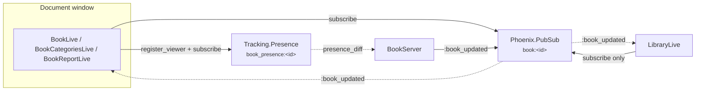
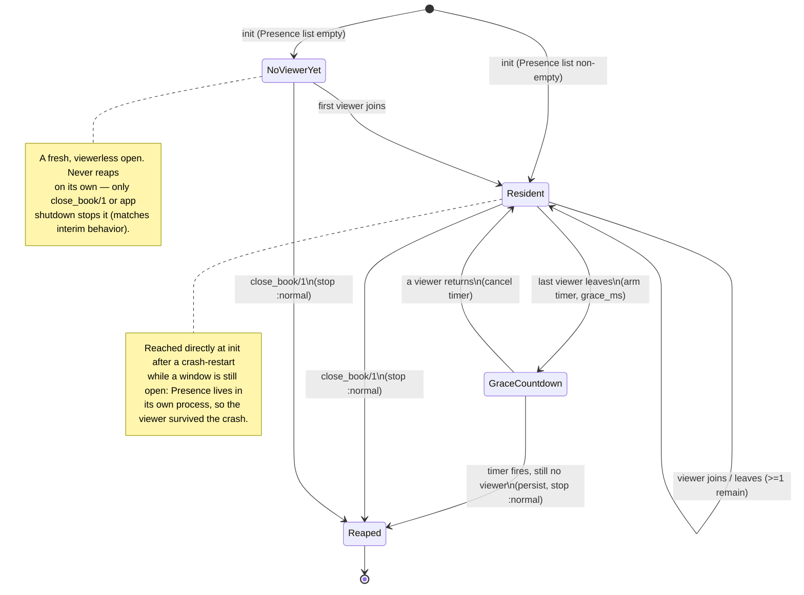

# Book Runtime Lifecycle

When a Book's `LocalCents.Tracking.BookServer` **starts**, how long it **stays
resident**, and when it **auto-shuts-down**. This is the viewer-driven lifecycle half
of the runtime; for the process/supervision and data-flow view see
[Book Runtime Architecture](book-runtime-architecture.html), and for the decision
behind it see [ADR 0007 — Book Runtime and Persistence](0007-book-runtime-and-persistence.html).

## The one-paragraph model

A `BookServer` starts when a Book is opened and **stops itself once its last viewer
disconnects**, so the library can hold many Books without keeping every document
resident. A **viewer** is a process that called `LocalCents.Tracking.register_viewer/1`
— in practice a document-window LiveView, wired uniformly through the shared
`LocalCentsWeb.BookWindow` `on_mount` hook. Viewers are tracked in
`LocalCents.Tracking.Presence` on a Book's dedicated `"book_presence:<id>"` topic. When
the last viewer leaves, the server waits out a short **grace period** and then persists
once more and stops; a viewer returning within that window cancels the reap.

## Viewer vs. subscriber — the load-bearing distinction

Two different things listen to a Book, and only one keeps it alive:

| | `subscribe/1` (passive) | `register_viewer/1` (viewer) |
|---|---|---|
| Mechanism | `Phoenix.PubSub.subscribe` on `"book:<id>"` | `Presence.track` on `"book_presence:<id>"` |
| Purpose | Receive `:book_updated` and re-render | Count toward keeping the runtime resident |
| Who | The three document-window views **and** the library window | The three document-window views only |
| Keeps the Book resident? | **No** | **Yes** |

This split is what lets `LocalCentsWeb.LibraryLive` subscribe to **every** Book's topic
— to keep its "Last Updated" subtitles live — without any of those Books being held
resident. Subscribing is passive; only tracking a viewer counts.



## Lifecycle state machine

The server reaps **only after it has held at least one viewer and then lost the last
one** ("Philosophy B"). A Book that never had a viewer — one created by `create_book/1`
with no window, or a bare `open_book/1` — stays resident until it is explicitly closed.



### Why the grace period

Navigation between a Book's views is a `push_navigate`, a full remount
([ADR 0017](0017-in-window-secondary-views.html)): the old view leaves Presence, then
the new one joins a moment later. Without a grace period, every ordinary in-window
navigation (and every browser refresh) would empty the viewer set for that gap, reap
the `BookServer`, and force a full reload from disk. The grace period bridges the gap
— and doubles as a "recently-closed Book stays warm for an instant reopen" window. It
defaults to **60s** and is configurable:

```elixir
config :local_cents, LocalCents.Tracking.BookServer, viewer_grace_ms: 60_000
```

The test environment shrinks it so the shutdown suite observes a reap promptly.

## A viewer opening and closing a window

```mermaid
sequenceDiagram
    participant V as Document window (LiveView)
    participant T as Tracking (facade)
    participant P as Presence
    participant S as BookServer

    V->>T: open_book(id)
    T->>S: ensure_started (init subscribes to book_presence:<id>)
    V->>T: subscribe(id) + register_viewer(id)
    T->>P: track(self(), "book_presence:<id>")
    P-->>S: presence_diff (join) → cancel any reap, mark ever_had_viewer

    Note over V,S: window is open; server stays resident

    V--xP: window closes (LiveView process dies)
    P-->>S: presence_diff (leave) → viewer set empty → arm reap (grace_ms)
    alt a viewer returns within grace (e.g. push_navigate)
        P-->>S: presence_diff (join) → cancel reap
    else grace elapses with no viewer
        S->>S: :reap → persist (terminate/2), stop :normal
    end
```

## Crash resilience and a known deferred edge

Because `Presence` is a **separate process**, a `BookServer` crash doesn't lose the
viewer set. The `:transient` server is restarted by its `DynamicSupervisor`, reads
`Presence.list/1` at `init`, and — if a window is still open — sees the viewer and
stays resident rather than reaping out from under it.

Two uncovered cases, both **memory-only and benign** — a Book stays resident that
could in principle be reaped; neither corrupts data or misleads the user:

- **Orphan crash-restart:** a server that crash-restarts *after* all its viewers
  already left comes back with an empty `Presence` list and, since it never observes a
  last-viewer-leaves transition, lingers resident until the app quits. A fix — an ETS
  marker owned by `Tracking.Supervisor`, checked at `init` to distinguish a restart
  from a first start — is noted but deliberately not built for the MVP.
- **Fast open-then-close:** a viewer that registers and dies before the server
  processes the join can coalesce into a single net-empty `presence_diff`, leaving
  `ever_had_viewer?` false, so the server never arms a reap and stays resident. This
  needs a viewer whose whole lifetime is shorter than one presence-diff round-trip —
  not a real window — and is reclaimed on `close_book/1` or app quit.
