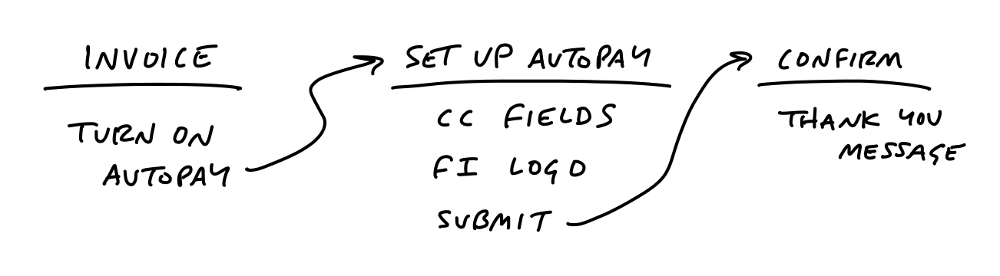
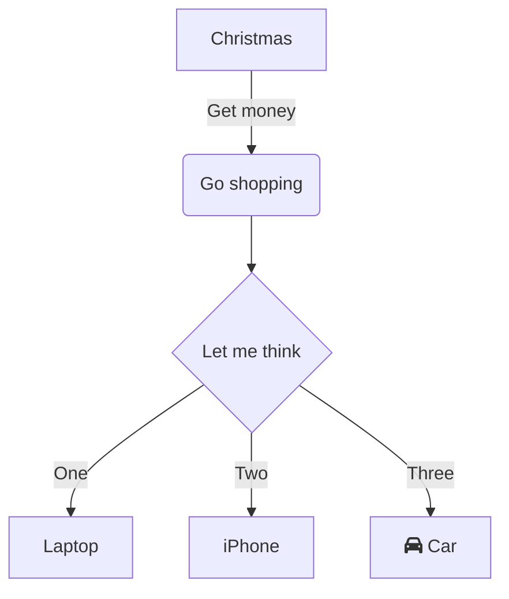

# Breadboard Demo

Breadboarding a user interface is a brainstorming process I first read about in the book [ShapeUp](https://basecamp.com/shapeup/1.3-chapter-04#breadboarding).

The basic idea is, before one starts to layout interface elements on a page, you should first conceptualize the job to be done by capturing:

- **places** -- these are things you can navigate to, like screens, dialogs, or menus that pop up.
- **affordances** -- these are things the user can act on, like buttons and fields. We consider interface copy to be an affordance, too. Reading it is an act that gives the user information for subsequent actions.
- **connection lines** -- these show how the affordances take the user from place to place.

When put together it can look like:

