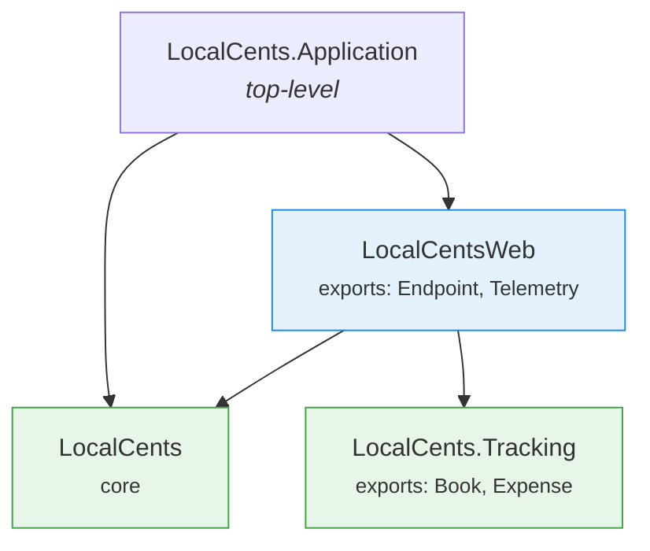
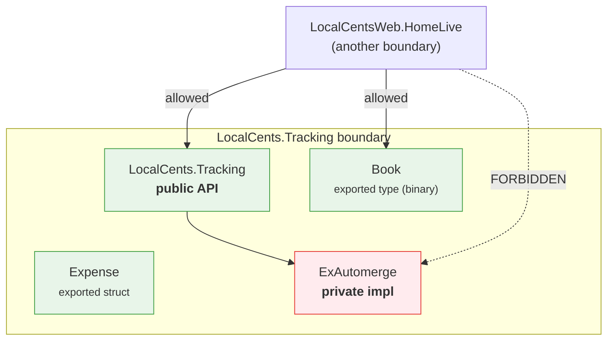

# Module Boundaries

LocalCents uses the [`boundary`](https://hexdocs.pm/boundary) library to keep our
domain contexts isolated from one another and from the web layer. This document
explains what problem it solves, how our boundaries are arranged, and how you can
see it work (and fail) for yourself.

## Why we use it

As the domain grows we will have several contexts (today just `Tracking`, later
things like budgeting, reporting, and syncing). We want each context to present a
single, deliberate **public API** at its front door, and we want the internal
implementation to stay private.

Without enforcement, nothing stops a LiveView from reaching past a context's API
and calling a helper buried three modules deep:

```elixir
# We do NOT want call sites doing this:
LocalCents.Tracking.ExAutomerge.decode(book_bytes)
```

That kind of call couples the caller to an implementation detail. If we later
change how `Tracking` stores data, every call site that jumped inside breaks.

Boundary turns this from a code-review convention into a **compile-time rule**.
Each context declares which of its modules are exported; a call from another
boundary to a non-exported module is reported as a compiler warning (and fails
the build under `--warnings-as-errors`, which is what `mix precommit` and CI use).

The rule we are enforcing, in one sentence:

> Call sites must go through a context's public API module. The context's
> internals are off-limits from the outside.

## The boundaries in this app

Every module belongs to exactly one boundary, determined by its name. A boundary
is declared by calling `use Boundary` in a module and listing its `deps` (which
other boundaries it may call) and `exports` (which of its own modules others may
call).

| Boundary | Declared in | Exports | May depend on |
|---|---|---|---|
| `LocalCents` | `lib/local_cents.ex` | — | — |
| `LocalCents.Tracking` | `lib/local_cents/tracking.ex` | `Book`, `Expense` | — |
| `LocalCentsWeb` | `lib/local_cents_web.ex` | `Endpoint`, `Telemetry` | `LocalCents`, `LocalCents.Tracking` |
| `LocalCents.Application` | `lib/local_cents/application.ex` | — | `LocalCents`, `LocalCentsWeb` |
| `Storybook` | `lib/storybook.ex` | (checks disabled) | (checks disabled) |

A boundary's root module (e.g. `LocalCents.Tracking`) is **always** callable from
a boundary that depends on it — that is the public API. `exports` only adds
*additional* modules to the public surface, which is why we export the `Book` and
`Expense` data types (they are part of the contract passed across the boundary)
but not `ExAutomerge` (the implementation). `Expense` is a struct; `Book` is an
opaque `binary()` type (a serialized Automerge document).

### How the layers relate



An arrow means "is allowed to call". Note the arrows only point *toward* contexts
and the core — a context never depends on the web layer, and contexts do not reach
into each other unless a dependency is declared explicitly.

Each domain context is a **top-level boundary** (`top_level?: true`) even though
it is namespaced under `LocalCents.*`. This makes it a peer of the core and web
layers so those layers can list it in their `deps`. (A boundary may only depend on
a sibling, its parent, or a dependency of an ancestor — a plain nested boundary
could not be depended on by `LocalCentsWeb`.)

`LocalCents.Application` is also promoted to top-level so it can depend on *both*
the core and the web layer to build the supervision tree, without creating a
dependency cycle between `LocalCents` and `LocalCentsWeb`.

### Inside a context: public vs. private



`LocalCentsWeb` may call `LocalCents.Tracking` and use the `Book` and `Expense`
types, but calling `LocalCents.Tracking.ExAutomerge` directly is a boundary
violation.

## Demo: make a violation appear

You can watch Boundary catch a bad call in about a minute.

**1. Add a forbidden call.** Open `lib/local_cents_web/live/home_live.ex` and, inside
`mount/3`, reach into a `Tracking` internal that is *not* exported:

```elixir
@impl Phoenix.LiveView
def mount(_params, _session, socket) do
  # Deliberately call a private implementation module of the Tracking context.
  _ = LocalCents.Tracking.ExAutomerge.new_document()
  {:ok, assign(socket, count: 0)}
end
```

**2. Compile.** Run:

```console
$ mix compile --force
```

Boundary reports the violation as a warning that points at the exact line:

```text
warning: forbidden reference to LocalCents.Tracking.ExAutomerge
  (module LocalCents.Tracking.ExAutomerge is not exported by its owner boundary LocalCents.Tracking)
  lib/local_cents_web/live/home_live.ex:6
```

**3. See how CI would treat it.** The warning does not fail a normal compile, so
try it the way `mix precommit` does:

```console
$ mix compile --force --warnings-as-errors
```

Now the build fails, because the boundary violation is promoted to an error.

**4. Fix it the right way.** The supported path is to go through the public API,
which *is* allowed from `LocalCentsWeb`:

```elixir
_ = LocalCents.Tracking.create_book("Family Expenses")
```

Recompile and the warning is gone. **Remember to revert the demo edit** — it was
only there to see the check fire.

### Try the other direction

For a different flavor of violation, add a call from the core to the web layer
(which the core is not allowed to depend on), e.g. put
`LocalCentsWeb.Endpoint.url()` inside a function in `lib/local_cents.ex` and
compile. You will get:

```text
warning: forbidden reference to LocalCentsWeb
  (references from LocalCents to LocalCentsWeb are not allowed)
```

## Adding a new context

When you introduce a new domain context, follow the `Tracking` pattern:

1. Create the context's public API module, e.g. `lib/local_cents/budgeting.ex`.
2. Declare it as a top-level boundary and export only its contract:

   ```elixir
   defmodule LocalCents.Budgeting do
     use Boundary, top_level?: true, deps: [], exports: [Budget]
     # ...
   end
   ```

3. If the web layer (or another context) needs to call it, add it to that
   boundary's `deps`, e.g. in `lib/local_cents_web.ex`:

   ```elixir
   use Boundary,
     deps: [LocalCents, LocalCents.Tracking, LocalCents.Budgeting],
     exports: [Endpoint, Telemetry]
   ```

4. Keep implementation modules unexported. Only the API module and the data
   types (structs or type aliases) that cross the boundary belong in `exports`.

## Useful commands

```console
# Print every boundary with its exports and deps.
mix boundary.spec

# Show external (library) dependencies grouped by boundary.
mix boundary.find_external_deps

# Generate Graphviz .dot files visualizing the boundaries.
mix boundary.visualize
```

## Troubleshooting

**`unknown module X is listed as an export`** — if your editor or an
incremental compile flags an exported module (e.g. `LocalCents.Tracking.Book`)
as unknown, even though it plainly exists, this is a
[known Boundary quirk](https://github.com/sasa1977/boundary/issues/72) with
incremental compilation: when only the boundary file recompiles, Boundary can
check its `exports:` against a partial view of the app's modules. A full,
clean compile always resolves it:

```console
mix clean && mix compile
```

Restarting your editor's Elixir language server does the same. CI avoids the
issue by building `_build` from scratch (see the `cache-key` note in
`.github/actions/elixir-setup/action.yaml`).
