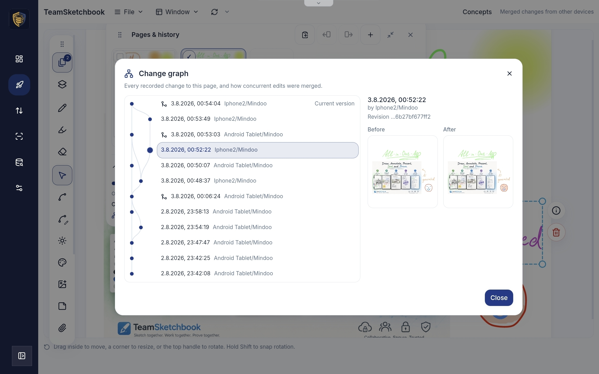

# How CRDT / local-first products present conflicts, history, and debugging

> Research note feeding [issue #212](https://github.com/zorn/local_cents/issues/212) — "how do other CRDT / local-first / Automerge products present conflicts, change history, and debugging to their users?"
> This is field-survey research for when we design our own conflict-presentation UI. Every non-obvious claim links a primary source: official docs, source repos, live demos, or (for closed products) the vendor's own engineering write-up. Where a fact rests on a third-party tutorial or could not be confirmed from a primary source, it is marked **unverified**.
>
> **Known gap — not covered here.** The Automerge Discord `#look-what-i-made` channel is a rich catalog of community projects, but it sits behind a login and is not reachable by an AFK research agent. This note does **not** cover it. Two projects already surfaced from that channel — MindooDB and Mindoo TeamSketchbook — are included below as seeds. The human will hand-feed more names or exports later.

## Where this note lives

Placed at `docs/research/crdt-conflict-ux-survey.md` to match the existing on-disk convention (`docs/research/*.md`, e.g. `automerge-last-updated.md`). Research-note placement is unsettled per [issue #209](https://github.com/zorn/local_cents/issues/209); if #209 moves research notes out of the repo, this file moves with them.

## The one finding that frames everything

Across every inspectable CRDT / local-first product surveyed, **the default is silent automatic merge — not interruption**. No product ships a Git-style blocking merge-conflict dialog, and none shows inline conflict markers to end users in normal operation. The interesting design work happens in two places that are *not* a conflict dialog:

1. **Replacing conflicts with branch-and-review** (Ink & Switch's Patchwork and Upwelling) — propose a change on a branch, review it, accept or discard, like code review.
2. **Replacing conflicts with after-the-fact history / audit UI** — version history, per-field provenance, and (rarely) a change-graph inspector. This is where the "debugging" angle for our demo has the most precedent.

Only two products in the whole survey deliberately *surface* a conflict to the user, and both are document/note tools where free text can't be safely auto-merged: **Obsidian** ("keep both copies" conflict file) and **PouchDB/CouchDB** (explicit `_conflicts` API the app must resolve).

## Automerge's own conflict model (our baseline)

We build on Automerge, so its model is the starting point everything else is measured against.

- Automerge **resolves silently by default and hands the raw conflict to the developer.** Reading a property returns one deterministically-chosen winner: *"Automerge chooses one value arbitrarily (but deterministically… any two nodes who have the same set of changes will choose the same value)"* — [getConflicts API docs](https://automerge.org/automerge/api-docs/js/functions/getConflicts.html). The "winner" is decided by internal operation IDs (counter + actor ID), **not wall-clock time** — [Conflicts reference](https://automerge.org/docs/reference/documents/conflicts/).
- **Losing values are preserved, not discarded.** `getConflicts(doc, prop)` returns an object keyed by operation ID holding *"both the 'winner' and any 'losers'."* A conflict clears automatically on the next write to that property — [Conflicts reference](https://automerge.org/docs/reference/documents/conflicts/).
- **The docs are explicit that surfacing/resolving conflicts in the UI is the app developer's job.** You *"might use the information in the conflicts object to show the conflict in the user interface"* — the library does none of that itself — [Conflicts reference](https://automerge.org/docs/reference/documents/conflicts/). Source: [github.com/automerge/automerge](https://github.com/automerge/automerge).

So for LocalCents, silent field-level convergence is free; any conflict *presentation* or history *inspector* is ours to build. That is precisely the design space this survey maps.

## Catalog — commercial vs open-source

### Open-source / inspectable (source or live demo we can actually poke at)

| Product | What it is | CRDT / sync tech | Inspectable |
|---|---|---|---|
| [Automerge](https://automerge.org/) | JSON-like CRDT library | LWW + multi-value registers, sequence/text CRDT | Source + docs ([repo](https://github.com/automerge/automerge)) |
| [Yjs](https://github.com/yjs/yjs) | CRDT library for collab apps | CRDT; diff exchange via state vectors ([docs](https://docs.yjs.dev/api/document-updates)) | Source + runnable [yjs-demos](https://github.com/yjs/yjs-demos) |
| [tldraw](https://github.com/tldraw/tldraw) | Collaborative infinite canvas | Own store (`@tldraw/sync-core`), server-authoritative — **not** Yjs ([sync docs](https://tldraw.dev/docs/sync)) | Source + live [tldraw.com](https://tldraw.com) |
| [Actual Budget](https://actualbudget.org/) | Local-first budgeting app (**domain twin**) | Message log + hybrid logical clock + merkle tree; field-level LWW ([jlongster](https://archive.jlongster.com/using-crdts-in-the-wild)) | MIT source ([repo](https://github.com/actualbudget/actual)) + [live demo](https://demo.actualbudget.org/) |
| [crdt-example-app](https://github.com/jlongster/crdt-example-app) | James Long's reference "CRDTs for Mortals" demo | HLC + merkle tree, LWW-per-field | Tiny source (~770 LOC) |
| [InstantDB](https://www.instantdb.com/) | "Firebase-style" local-first relational DB | Postgres WAL-tailing; attribute-level LWW, `merge` for nested JSON ([instaml](https://www.instantdb.com/docs/instaml)) | Apache-2.0 [source](https://github.com/instantdb/instant) + docs |
| [Jazz](https://jazz.tools/) | Local-first framework (CoValues) | CRDT (CoJSON); per-field LWW + collaborative lists/text; git-like snapshot history ([what-is-jazz](https://jazz.tools/blog/what-is-jazz)) | [Source](https://github.com/garden-co/jazz) + hosted [inspector](https://v2.inspector.jazz.tools/) |
| [Replicache](https://replicache.dev/) / [Zero](https://zero.rocicorp.dev/) | Sync engines (Rocicorp) | **Not CRDT** — server-authoritative mutations + rebase ([how-it-works](https://doc.replicache.dev/concepts/how-it-works)) | Source ([mono](https://github.com/rocicorp/mono)) + docs |
| [MindooDB](https://mindoodb.com/) | E2E-encrypted local-first sync DB (Discord seed) | **Automerge**-based; Ed25519-signed changes ([repo](https://github.com/klehmann/MindooDB)) | Apache-2.0 source + live beta [haven.mindoodb.com](https://haven.mindoodb.com) |
| Mindoo TeamSketchbook | Offline-collab infinite canvas (Discord seed) | MindooDB → Automerge; stroke-level merge ([mindoodb.com](https://mindoodb.com/)) | Live via Haven beta; standalone repo **unverified** |
| [PouchDB / CouchDB](https://pouchdb.com/guides/conflicts.html) | Multi-master document DB (**contrast case**) | Revision trees; deterministic winner, both revs retained | Open source + docs |
| Yjs `prosemirror-versions` | Version-history demo | Yjs snapshots | [Source + run instructions](https://github.com/yjs/yjs-demos/tree/master/prosemirror-versions) |
| Ink & Switch [Patchwork](https://www.inkandswitch.com/project/patchwork/), [Upwelling](https://www.inkandswitch.com/upwelling/), [PushPin](https://github.com/automerge/pushpin) | Research prototypes (version control / drafts / corkboard) | Automerge (Upwelling on an experimental fork) | PushPin source public; Patchwork [lab notebook](https://www.inkandswitch.com/patchwork/notebook/) public, hosted demo **unverified** |

### Commercial / closed (docs + engineering write-ups only; backend not inspectable)

| Product | What it is | CRDT / sync tech | Inspectable |
|---|---|---|---|
| [Liveblocks](https://liveblocks.io/docs) | Real-time collab infrastructure | Hosts Yjs + own conflict-free Storage types | SDK source public; hosted backend closed |
| [Tiptap](https://tiptap.dev/docs/collaboration/documents/snapshot) Snapshot | Rich-text collab + version snapshots | Yjs (Hocuspocus provider) | Docs public; extension gated behind auth |
| [Obsidian](https://obsidian.md/help/sync/) Sync | Note app, E2E sync | Markdown auto-merge (`diff-match-patch`); non-Markdown "last modified wins" | Closed source; docs only |
| [Linear](https://linear.app/) (LSE) | Issue tracker, local-first sync engine | LWW, server-authoritative, client rebase | Closed; best artifact is CTO-endorsed [reverse-engineering repo](https://github.com/wzhudev/reverse-linear-sync-engine) |
| [Figma](https://www.figma.com/blog/how-figmas-multiplayer-technology-works/) | Collaborative design | CRDT-inspired, centralized; property-level LWW | Closed; engineering blog only |
| [Notion](https://www.notion.com/help/duplicate-delete-and-restore-content) | Cloud docs/workspace | Server-authoritative (online-first) | Closed; help docs only |

## (a) Conflict presentation — how each shows (or hides) a conflict

**Silent automatic merge, no user-facing conflict (the overwhelming majority):**

- **Yjs / Liveblocks / Tiptap / Jazz / InstantDB** — CRDT convergence, no banner, no chooser, no markers. Yjs "prevents conflicts by design, rather than requiring conflict detection and resolution logic" — [docs.yjs.dev](https://docs.yjs.dev/api/document-updates). Jazz per-field LWW resolves automatically; because it keeps full history an app *can* surface prior values but the framework never prompts — [what-is-jazz](https://jazz.tools/blog/what-is-jazz).
- **tldraw / Replicache / Zero / Linear / Figma** — server-authoritative rebase. Client applies optimistically, then on a server delta rolls back local changes, applies the server's, and replays local on top. tldraw: *"the server is authoritative for conflict resolution"* — [tldraw.dev](https://tldraw.dev/sdk-features/collaboration). Figma keeps *"the latest value any client sent for a given property"* = property-level LWW — [Figma blog](https://www.figma.com/blog/how-figmas-multiplayer-technology-works/). Linear rebases onto the server's winning value with no prompt — [reverse-engineering README](https://github.com/wzhudev/reverse-linear-sync-engine).
- **Actual Budget** — *"fully conflict-free, the user never has to worry about conflicts"*; field-level LWW by HLC timestamp — [jlongster](https://archive.jlongster.com/using-crdts-in-the-wild). The **only** user-facing sync interruption is a rare "Syncing Has Been Reset on This Cloud File" notification — [sync docs](https://actualbudget.org/docs/getting-started/sync/). This is the realistic baseline for a money app.
- **MindooDB / TeamSketchbook** — inherit Automerge's silent merge (stroke-by-stroke for the canvas), but make merges *auditable* after the fact rather than hidden — [repo](https://github.com/klehmann/MindooDB) / [mindoodb.com](https://mindoodb.com/).

**Branch-and-review instead of a conflict dialog (Ink & Switch):**

- **Patchwork** — lightweight branches, then *review and accept/reject* like code review; branches merge back or are discarded — [Litt essay](https://buttondown.com/geoffreylitt/archive/towards-universal-version-control-with-patchwork/).
- **Upwelling** — "drafts" (lightweight branches) give authors *creative privacy*; a draft is shared/merged only when ready — [Upwelling essay](https://www.inkandswitch.com/upwelling/).

**Deliberately surface the conflict (the two exceptions — both document/note tools):**

- **Obsidian** — per-device setting. Default auto-merges Markdown (can leave "duplicate text" to clean up). Since v1.9.7 a **"Create conflict file"** mode keeps a **side-by-side copy** named `... (Conflicted copy device-name YYYYMMDDHHMM).md` for manual merge; conflicts are auditable via the Sync log — [troubleshoot docs](https://obsidian.md/help/sync/troubleshoot). This is the "keep both copies" pattern, not an interrupting chooser.
- **PouchDB / CouchDB** — CRDT-adjacent contrast case. Picks a deterministic winner so replicas agree, but **retains both revisions**; the app fetches with `{conflicts: true}`, gets a `_conflicts` array, and must resolve — often by showing both versions to the user. Conflicts are **not** auto-cleared — [conflicts guide](https://pouchdb.com/guides/conflicts.html).

## (b) Change-over-time / history / debug UI

**Per-field provenance ("who changed this field, and when"):**

- **Jazz** is the standout. Every CoValue keeps its full edit history; *"you often don't need explicit timestamps and author info — you get this for free."* Read edits via `coValue.$jazz.getEdits().<field>`, exposing `.by` (who), `.madeAt` (when), and the value — [Jazz docs](https://jazz.tools/docs), [0.18.0 upgrade](https://jazz.tools/docs/react/upgrade/0-18-0). This maps directly onto an expense field like `amount` or `category`. Exact `.all`-vs-latest accessor shapes are **partially unverified** (some doc pages 404'd for the agent; confirmed via the upgrade page).
- Everyone else exposes provenance only at **version granularity**, not per-field. Tiptap records contributors per version (`changesBy`); Yjs `UndoManager` separates local vs remote authorship via `trackedOrigins`. True per-field provenance to end users was not found elsewhere.

**Change-graph / audit inspector (closest to a "debugging" view):**

- **MindooDB** ships a built-in **DAG explorer**: *"inspect documents, compare any two revisions side by side, and explore the full signed change graph"*; branches show concurrent edits and merge nodes show how Automerge resolved them, plus tamperproof append-only history and "Time Travel" — [repo](https://github.com/klehmann/MindooDB) / [mindoodb.com](https://mindoodb.com/). This is the most explicit end-user change-graph inspector found, and it is Automerge-based. A screenshot of it running in TeamSketchbook (a MindooDB product) is captured below, so this claim is no longer vendor-copy only.

*MindooDB's change-graph, captured from TeamSketchbook running (2026-08). The forking-and-rejoining line and the branch glyphs mark where concurrent edits from different devices merged — the dialog subtitle says it outright: "Every recorded change to this page, and how concurrent edits were merged." The right pane shows a Before/After of the selected revision. This is the single closest reference for our own conflict/history UI; note how per-node device+timestamp provenance and the visible merge points map onto a per-Book (or per-expense) change graph for LocalCents, including a place the edit-vs-delete "dropped edit" (see [#213](https://github.com/zorn/local_cents/issues/213)) could surface as a superseded branch rather than vanishing.*
- **Jazz Inspector** — floating dev panel (Cmd+J, or embed `JazzInspector`) showing a CoValue's current state, **history**, and sync status; also hosted at [v2.inspector.jazz.tools](https://v2.inspector.jazz.tools/) — [inspector docs](https://jazz.tools/docs/react/tooling-and-resources/inspector).
- **InstantDB Devtool** — in-app widget (`Ctrl+Shift+0`) with an Explorer (inspect/modify data + schema) and a Sandbox (try queries/transactions) — [devtool docs](https://www.instantdb.com/docs/devtool). Developer-facing, no end-user history.
- **Patchwork** — the richest *history* prototype: visual diffs at small and large scale (including on a tldraw canvas), edits grouped into "reviewable units," a chat-like interface to document history, and AI-generated branch names / edit descriptions — [Litt essay](https://buttondown.com/geoffreylitt/archive/towards-universal-version-control-with-patchwork/), [notebook 08](https://www.inkandswitch.com/patchwork/notebook/08/).
- **Upwelling** — Patchwork's predecessor, an Automerge prose editor: authors work in named **drafts** ("Reworking the introduction") that merge into a permanent **stack**; every keystroke is tracked automatically, changes are shown by author color (deletions as a ➰ rather than strikethrough), and selecting any past layer answers *"what changed since point X?"* Its headline finding is the one that most supports our direction — *"automatic merging is necessary but not sufficient"*: semantic conflicts need human judgment no matter how good the CRDT — [Upwelling](https://www.inkandswitch.com/upwelling/).

**Version history (time-based snapshots, restorable) — the mainstream "change over time" surface:**

- **Liveblocks** — its strongest visible feature: browse, preview, restore version snapshots (`useHistoryVersions`, `useRestoreToStorageVersion`) — [version-history guide](https://liveblocks.io/docs/guides/how-to-add-version-history-to-your-app), [REST endpoints](https://liveblocks.io/docs/api-reference/rest-api-endpoints).
- **Yjs `prosemirror-versions` demo** — create named snapshots, click a version to view a **diff vs the previous one with per-user color highlighting** — [source](https://github.com/yjs/yjs-demos/tree/master/prosemirror-versions). Fully open source and runnable; the most inspectable color-coded diff UI in the survey.
- **Tiptap Snapshot** — `saveVersion()` + autoversioning every 30s; compare-snapshots diff highlighting; revert preserves unsaved work as a backup; per-version metadata records trigger source and contributors — [snapshot docs](https://tiptap.dev/docs/collaboration/documents/snapshot).
- **Figma** — checkpoints every 30 min, name versions, non-destructive restore, main contributor shown per version; retention plan-gated — [version-history help](https://help.figma.com/hc/en-us/articles/360038006754).
- **Notion** — snapshots ~every 10 min, open + Restore, retention plan-gated (7/30/90 days, Enterprise unlimited) — [help](https://www.notion.com/help/duplicate-delete-and-restore-content).
- **Obsidian Sync** — version history for all notes, restorable, retained up to a year — [version-history docs](https://obsidian.md/help/sync/version-history).

**Undo (as a substitute for both):**

- **Actual Budget** — Ctrl+Z / Ctrl+Shift+Z; on desktop "any change can be undone and the UI will walk back in time," web undo is session-only — [tips-tricks](https://actualbudget.org/docs/getting-started/tips-tricks/). No per-record version browser.
- **Yjs `UndoManager`** — per-type undo/redo stacks, 500ms capture window, `trackedOrigins` so undo doesn't revert remote peers — [docs](https://docs.yjs.dev/api/undo-manager).

**A gap worth noting:** in the local-first *money* apps (Actual, crdt-example-app), the merkle tree that checks "are we in sync?" is an **internal** divergence-detection mechanism, never surfaced. No end-user sync-status / debug view exists in any money app surveyed — a genuine opening for our debugging angle.

## (c) Shortlist — the 2-3 UIs most worth deep-diving when we prototype

1. **MindooDB's DAG explorer + side-by-side revision compare + time travel.** It is the single closest reference: **Automerge-based**, open source, live demo, and the only product that turns silent CRDT merges into an inspectable **change-graph / audit view** — exactly our "debugging" angle. Deep-dive the branch/merge-node visualization and the two-revision compare. [github.com/klehmann/MindooDB](https://github.com/klehmann/MindooDB), [mindoodb.com](https://mindoodb.com/).

2. **Actual Budget.** The **domain twin** — a real, shipped, fully-inspectable local-first *money* app. It shows the pragmatic baseline an expense tracker actually ships: silent field-level LWW, undo instead of a version browser, and a rare "sync was reset" banner as the *only* interruption. Study what it deliberately chose **not** to build. [github.com/actualbudget/actual](https://github.com/actualbudget/actual), [demo.actualbudget.org](https://demo.actualbudget.org/).

3. **Jazz — `$jazz.getEdits()` + the Jazz Inspector.** The best model for **per-field provenance**: "who set this amount, and when," available per field for free, plus a live inspector showing a value's history and sync status. Directly answers "why does this expense say $12 now?" at the field level. [jazz.tools/docs](https://jazz.tools/docs), [v2.inspector.jazz.tools](https://v2.inspector.jazz.tools/).

**Honorable mentions to sample, not deep-dive:** the **Yjs `prosemirror-versions`** demo for its color-coded per-author diff (open + runnable); **Obsidian's "Create conflict file"** and **PouchDB's `_conflicts`** as the two examples of actually *surfacing* a conflict, useful if we ever decide a specific field (e.g. a hand-typed note) shouldn't auto-merge silently; and **Patchwork** / **Upwelling** for the ambitious branch/review + drafts-and-stack vision (and Upwelling's "auto-merge is necessary but not sufficient" finding) if we ever go beyond field-level.

## Gaps and caveats

- **Automerge Discord `#look-what-i-made`** — not covered (login-gated, not scrapeable). Human to hand-feed names/exports. MindooDB and TeamSketchbook are the two seeds already pulled from it.
- **Vendor-described features not independently exercised** — MindooDB's DAG explorer / time travel come from its own site and README (open source, so checkable, but not run by the agent).
- **Closed products** — Linear and Figma conflict internals rest on a CTO-endorsed reverse-engineering repo and an engineering blog respectively, not official docs. Notion's offline conflict behavior has no primary source and is **unverified**.
- **Doc pages that 404'd for the agent** — some Jazz history/inspector pages and the official `docs.yjs.dev/api/snapshots` page; those claims were corroborated via upgrade pages, READMEs, or community docs and are flagged inline.
- **Not confirmed** — Patchwork's publicly hosted live demo; a standalone Mindoo TeamSketchbook source repo; whether the crdt-example-app demo renders any merkle/message-log panel.
